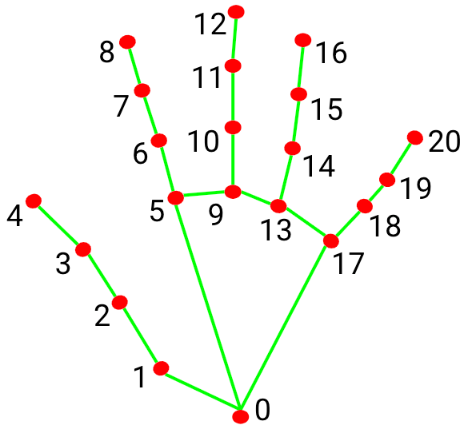

# REAL TIME GESTURE TRACKER

*Transforming Gestures into Instant Interactive Power*

---

*Built with the tools and technologies:*

<!-- Tech Stack -->

---

## Table of Contents

- [Overview](#overview)
- [Getting Started](#getting-started)
  - [Prerequisites](#prerequisites)
  - [Installation](#installation)
  - [Usage](#usage)
  - [Testing](#testing)

---

## Overview

 Real-time hand gesture recognition project using Python, OpenCV, and MediaPipe. Currently in early development — features will be improved and more gestures will be added. 

---

### Notes

min_detection_confidence = 0.7

<ul>
  <li>If confidence drops below <strong>0.5</strong>, MediaPipe will stop tracking that hand until it’s detected again.</li>
  <li>Higher values (e.g., 0.8) → more accuracy, but the hand may “disappear” more often if detection isn’t strong.</li>
  <li>Lower values (e.g., 0.3) → more tolerant, but increases the chance of false positives or “ghost” hands.</li>
</ul>

<h2>multi_hand_landmarks</h2>

Contains all the hands it found. Since we only allow 1 hand, this will have <strong>0 or 1</strong>.

<h2>How MediaPipe Hand Landmarks Work</h2>

MediaPipe gives us 21 points per hand, each with:

<ul>
  <li><code>x</code> = horizontal position (0 = left, 1 = right)</li>
  <li><code>y</code> = vertical position (0 = top, 1 = bottom)</li>
  <li><code>z</code> = depth (not important for this part)</li>
</ul>

The points are numbered in a fixed order:

<table border="1" cellpadding="5" style="border-collapse:collapse;">
  <tr>
    <th>Finger</th>
    <th>Indices</th>
    <th>Tip</th>
  </tr>
  <tr><td>Thumb</td><td>[1, 2, 3, 4]</td><td>4</td></tr>
  <tr><td>Index</td><td>[5, 6, 7, 8]</td><td>8</td></tr>
  <tr><td>Middle</td><td>[9, 10, 11, 12]</td><td>12</td></tr>
  <tr><td>Ring</td><td>[13, 14, 15, 16]</td><td>16</td></tr>
  <tr><td>Pinky</td><td>[17, 18, 19, 20]</td><td>20</td></tr>
</table>

